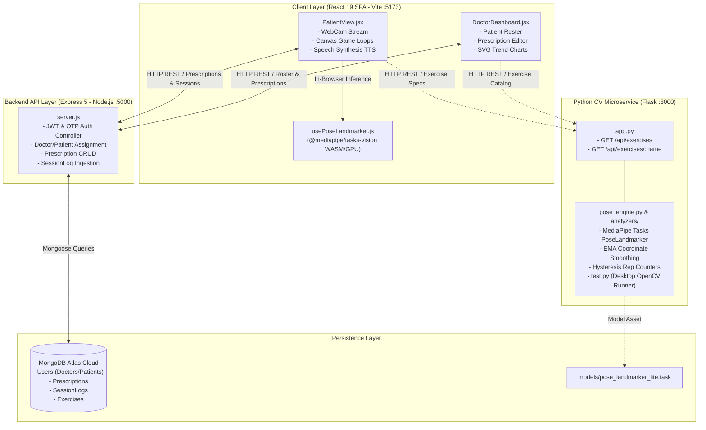
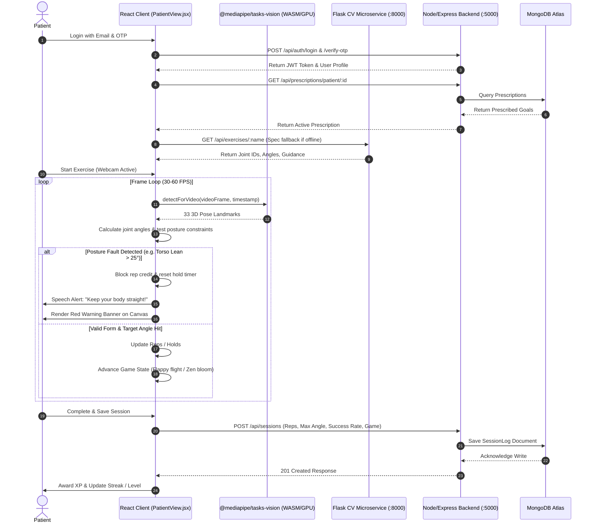

# PostCare (RehabSync) — Complete Technical Inspection & Architectural Report

---

## 1. Project Overview

### What is PostCare?
**PostCare** (originally named *RehabSync*) is a digital physical rehabilitation and motion-tracking platform designed to bridge the gap between clinical physical therapy and at-home recovery. It provides automated joint angle tracking, form validation, gamified physical rehabilitation exercises, prescription management, and longitudinal clinician oversight.

### What Problem Is the Current System Solving?
Traditional physical therapy requires patients to perform exercises at home between infrequent clinic visits. However, patients face:
1. **Lack of real-time biofeedback**: Patients do not know if they are hitting the correct range of motion (ROM) or compensating with bad form (e.g., arching the back or swinging the arm).
2. **Poor adherence & boredom**: Repetitive physical therapy regimens suffer from high drop-out rates.
3. **Disconnected clinician monitoring**: Doctors lack objective data on whether patients actually completed their exercises, what angles they achieved, or how compliant their posture was.

### The Intended User Workflow
1. **Clinician Workflow**: A doctor logs in, views their assigned patients, reviews past exercise sessions and historical Range of Motion (ROM) charts, and configures or updates patient-tailored prescriptions (target reps, success angles, failure angles, hold times).
2. **Patient Workflow**: A patient logs in (with email, password, and 6-digit OTP verification), views their prescribed exercises, chooses a game mode or standard tracker, performs the exercise in front of a standard webcam, receives real-time visual and voice feedback, and saves the completed session (reps, max angle, form compliance) to the doctor's portal.

### Major Features Currently Implemented
- **Dual-sided Pose Tracking**: Supports unilateral (left or right side toggle) and bilateral exercise tracking.
- **19-Exercise Catalog**: Comprehensive coverage of upper limb, lower limb, trunk, and balance exercises.
- **5 Clinical Interactive Canvas Engines**:
  - `Standard Tracker`: Mirrored video feed with skeleton bone overlay and joint indicators.
  - `Zen Bloom Garden`: Procedural plant growth and blooming engine driven by static stretch holds.
  - `Flappy Rehab Flight`: Neon obstacle course where flyer altitude is directly driven by joint flexion/extension.
  - `Shadow Match`: Silhouette keyhole matching requiring reset-to-start and goal-reach phases.
  - `3D Hologram Mannequin`: Rotatable 3D avatar with muscle activation volumes and joint coordinate callouts.
- **Voice Coaching**: Real-time text-to-speech audio prompts (`window.speechSynthesis`) for count updates and form violation alerts.
- **Doctor Portal**: Interactive patient roster, chronological SVG angle charts, session history tables, and slider-based prescription customization.
- **Gamification Suite**: XP progression, level milestones (250 XP/level), daily streaks, daily quest challenges, badges, and leaderboard rankings.
- **Dual Computer Vision Architectures**: A standalone Python CV microservice (`cv-service`) using MediaPipe Tasks VIDEO mode and a browser-native WebAssembly implementation in React (`@mediapipe/tasks-vision`).

### Simple vs. Technical Explanation
- **In Simple Terms**: PostCare is like an AI-powered physical therapist in your laptop. You open your camera, do your prescribed physical therapy exercises, play games controlled by your body movements, get voice corrections if your posture is wrong, and your doctor gets a complete progress report.
- **In Technical Terms**: PostCare is a decoupled, three-tier application composed of a Vite/React 19 single-page application executing in-browser `@mediapipe/tasks-vision` landmark inference, an Express 5 / Node.js REST API backed by MongoDB Atlas using Mongoose ORM for user authentication, session logs, and prescriptions, and a standalone Python 3 / Flask microservice implementing a MediaPipe Tasks `PoseLandmarker` pipeline with EMA smoothing, landmark jump rejection, hysteresis state machines, and direction-aware normalized ROM analyzers.

---

## 2. Complete Project Architecture



### Communication Between Components
1. **Frontend to Express Backend (`rehab-backend`, Port 5000)**: Communicates via standard JSON HTTP REST endpoints (`fetch`) for authentication, fetching/saving patient prescriptions, pulling patient roster lists, and submitting completed workout session telemetry.
2. **Frontend to CV Service (`cv-service`, Port 8000)**: Communicates via HTTP GET requests to fetch exercise specifications (landmark IDs, bilateral requirements, movement directions, and camera guidance) from [app.py](file:///e:/rehab-ai-platform-main/cv-service/app.py). If the Flask microservice is offline, the frontend falls back seamlessly to internal configuration objects ([OFFLINE_EXERCISE_SPECS](file:///e:/rehab-ai-platform-main/rehab-ai/src/pages/PatientView.jsx#L167-L288)).
3. **Frontend In-Browser CV Execution**: The active camera stream is processed frame-by-frame on the client device using `@mediapipe/tasks-vision` via WebAssembly and WebGL/GPU delegates. Video frames are **not** streamed across the network to Python; the Python service acts as the blueprint/metadata authority and standalone desktop inspection runner ([test.py](file:///e:/rehab-ai-platform-main/cv-service/test.py)).
4. **Backend to Database**: Node.js communicates with MongoDB Atlas using Mongoose schemas.

### Module Responsibility Breakdown
- **`rehab-ai` (Frontend)**: User interface, authentication state, camera stream capture, real-time client-side pose landmarking, 5 canvas game engines, voice feedback synthesis, and patient/doctor analytics presentation.
- **`rehab-backend` (Node API)**: Business logic, password validation, OTP generation and dispatch, MongoDB persistence, and clinician-patient relation management.
- **`cv-service` (Python Microservice)**: Mathematical modeling, formal joint angle definitions, direction-aware ROM normalization algorithms, threshold debouncing, local camera debugging CLI, and exercise spec REST endpoints.
- **`models/`**: Stores Google MediaPipe binary task model (`pose_landmarker_lite.task`).

---

## 3. Folder and File Structure

### Root Directory
- [`README.md`](file:///e:/rehab-ai-platform-main/README.md): High-level system overview, setup instructions, and port mappings.
- [`project_architecture.md`](file:///e:/rehab-ai-platform-main/project_architecture.md): Sequence diagrams and system topology documentation.
- [`walkthrough.md`](file:///e:/rehab-ai-platform-main/walkthrough.md): Feature changelog and verification audit.
- [`models/pose_landmarker_lite.task`](file:///e:/rehab-ai-platform-main/models/pose_landmarker_lite.task): 5.78 MB binary Google MediaPipe Pose Landmarker model.

---

### Module 1: Computer Vision Service (`cv-service/`)
- [`app.py`](file:///e:/rehab-ai-platform-main/cv-service/app.py): Flask application exposing REST endpoints:
  - `GET /`: Health check and list of all supported exercises.
  - `GET /api/exercises`: List of exercise names.
  - `GET /api/exercises/<name>`: Detailed configuration (landmark sets, target directions, rest/target angles, camera guidance).
- [`pose_engine.py`](file:///e:/rehab-ai-platform-main/cv-service/pose_engine.py): The core Python computer vision engine.
  - `class PoseEngine`: Manages `mp.tasks.vision.PoseLandmarker` in `VIDEO` mode, frame stabilization, coordinate EMA smoothing, jump rejection, visibility checks, side-locking, and state transitions (`stable`, `recovering`, `occluded`, `lost`).
  - `class SkeletonDebugger`: Renders dark-canvas stick-figure debug frames with landmark motion trails and telemetry text.
  - `def draw_result()`: Overlays skeleton connections and mirrored HUD text on camera frames.
- [`test.py`](file:///e:/rehab-ai-platform-main/cv-service/test.py): Desktop OpenCV debugging runner (`python test.py --exercise "Mini Squat" --debug`) with interactive keyboard controls (`Q` to quit, `R` to reset).
- [`test_pose_engine.py`](file:///e:/rehab-ai-platform-main/cv-service/test_pose_engine.py): `unittest` test suite covering mathematical calculations, alias normalization, hysteresis debouncing, jump rejection, and recovery.
- [`geometry/angles.py`](file:///e:/rehab-ai-platform-main/cv-service/geometry/angles.py):
  - `calculate_angle(a, b, c)`: Calculates the 2D inner angle between three points in degrees via vector dot products.
  - `ema(previous, current, alpha=0.35)`: Exponential moving average filter.
- [`exercises/registry.py`](file:///e:/rehab-ai-platform-main/cv-service/exercises/registry.py): Central catalog of 19 exercise definitions (`ExerciseConfig` dataclasses), aliases map (`ALIASES`), and normalization helper (`normalize_exercise_key`).
- [`exercises/analyzers/`](file:///e:/rehab-ai-platform-main/cv-service/exercises/analyzers/):
  - [`base.py`](file:///e:/rehab-ai-platform-main/cv-service/exercises/analyzers/base.py): Base class `BaseAnalyzer` managing direction-aware ROM normalization, rep counting with hysteresis, threshold confirmation frames (`_held`), session duration tracking, and composite form scoring (`_score`).
  - [`factory.py`](file:///e:/rehab-ai-platform-main/cv-service/exercises/analyzers/factory.py): `create_analyzer()` factory mapping registry keys to concrete analyzer classes.
  - [`joint_angle.py`](file:///e:/rehab-ai-platform-main/cv-service/exercises/analyzers/joint_angle.py): Analyzers for `JointAngleAnalyzer`, `ElbowFlexionAnalyzer`, `KneeExtensionAnalyzer`, `KneeFlexionAnalyzer`, `ShoulderFlexionAnalyzer`, `ShoulderAbductionAnalyzer`, `PushUpAnalyzer`, and `SquatAnalyzer`.
  - [`lower_limb.py`](file:///e:/rehab-ai-platform-main/cv-service/exercises/analyzers/lower_limb.py): Analyzers for `StraightLegRaiseAnalyzer`, `HipAbductionAnalyzer`, `HipFlexionAnalyzer`, and `CalfRaiseAnalyzer`.
  - [`functional.py`](file:///e:/rehab-ai-platform-main/cv-service/exercises/analyzers/functional.py): Complex analyzers for `MiniSquatAnalyzer`, `SitToStandAnalyzer`, `WallSlideAnalyzer`, `MarchingAnalyzer` (cadence & step tracking), `BalanceAnalyzer` (hip sway & hold timer), and `BirdDogAnalyzer` (contralateral limb extensions).

---

### Module 2: Express Backend (`rehab-backend/`)
- [`server.js`](file:///e:/rehab-ai-platform-main/rehab-backend/server.js): Monolithic Express 5 server containing:
  - Database schemas: `User`, `Prescription`, `Exercise`, `SessionLog`.
  - Auto-seeder function (`seedDatabase()`): Automatically provisions initial exercises, doctor account, patient accounts, and historical mock sessions on startup.
  - Nodemailer transporter configured for Gmail SMTP OTP delivery.
  - REST route handlers for Authentication, Doctor Dashboard, Prescriptions, Exercises, and Session Logs.
- [`package.json`](file:///e:/rehab-ai-platform-main/rehab-backend/package.json): Defines dependencies: `express` 5.2.1, `mongoose` 9.9.3, `jsonwebtoken` 9.0.3, `bcryptjs` 3.0.3, `nodemailer` 9.0.5, `cors`, `dotenv`.

---

### Module 3: Frontend Client (`rehab-ai/`)
- [`src/config.js`](file:///e:/rehab-ai-platform-main/rehab-ai/src/config.js): Exports `API_URL` (default `http://localhost:5000`) and `CV_API_URL` (default `http://localhost:8000`).
- [`src/App.jsx`](file:///e:/rehab-ai-platform-main/rehab-ai/src/App.jsx): Main router declaring routes: `/`, `/auth`, `/scanner`, `/doctor`, `/library`, `/for-doctors`.
- [`src/hooks/usePoseLandmarker.js`](file:///e:/rehab-ai-platform-main/rehab-ai/src/hooks/usePoseLandmarker.js): Custom React hook that initializes `@mediapipe/tasks-vision` FilesetResolver (WASM) and creates a `PoseLandmarker` instance with GPU acceleration.
- [`src/supabaseClient.js`](file:///e:/rehab-ai-platform-main/rehab-ai/src/supabaseClient.js): Standalone Supabase client initialization (Note: unused in active codebase; MongoDB is the primary database).
- [`src/pages/PatientView.jsx`](file:///e:/rehab-ai-platform-main/rehab-ai/src/pages/PatientView.jsx): 1,646-line main patient interface. Contains the camera stream handler, MediaPipe execution loop, joint angle math, form validation checks, game engine dispatch, voice synthesis triggers, XP and leveling calculations, quest management, badge achievements, and session save handlers.
- [`src/pages/DoctorDashboard.jsx`](file:///e:/rehab-ai-platform-main/rehab-ai/src/pages/DoctorDashboard.jsx): Clinical interface. Features patient search, patient roster, interactive prescription sliders, session history table, and SVG progress charts for ROM and repetitions.
- [`src/pages/Auth.jsx`](file:///e:/rehab-ai-platform-main/rehab-ai/src/pages/Auth.jsx): Login and Registration page supporting password authentication with OTP verification steps for patients.
- [`src/pages/LandingPage.jsx`](file:///e:/rehab-ai-platform-main/rehab-ai/src/pages/LandingPage.jsx): Marketing homepage explaining system benefits and workflow.
- [`src/pages/Library.jsx`](file:///e:/rehab-ai-platform-main/rehab-ai/src/pages/Library.jsx): Searchable exercise reference library detailing target joints and execution tips.
- [`src/pages/ForDoctors.jsx`](file:///e:/rehab-ai-platform-main/rehab-ai/src/pages/ForDoctors.jsx): Clinician landing page.
- [`src/components/Navbar.jsx`](file:///e:/rehab-ai-platform-main/rehab-ai/src/components/Navbar.jsx): Global navigation bar handling session state and logout.
- [`src/games/`](file:///e:/rehab-ai-platform-main/rehab-ai/src/games/):
  - [`standardTracker.js`](file:///e:/rehab-ai-platform-main/rehab-ai/src/games/standardTracker.js): 2D video mirror with active bone highlighting and red form violation warning banners.
  - [`zenBloom.js`](file:///e:/rehab-ai-platform-main/rehab-ai/src/games/zenBloom.js): Procedural botanical garden that blooms during held stretches.
  - [`flappyRehab.js`](file:///e:/rehab-ai-platform-main/rehab-ai/src/games/flappyRehab.js): Adaptive flight game where flyer height is tied to joint angle, featuring combos and adaptive difficulty.
  - [`shadowMatch.js`](file:///e:/rehab-ai-platform-main/rehab-ai/src/games/shadowMatch.js): Silhouette target matching with dual-phase calibration ('start' vs 'goal').
  - [`mannequinTracker.js`](file:///e:/rehab-ai-platform-main/rehab-ai/src/games/mannequinTracker.js): 3D rotating holographic anatomical avatar with muscle heatmaps.

---

## 4. Computer Vision / ML Pipeline

### Input
- **Python Service (`cv-service`)**: Unmirrored BGR webcam video frames (640x480) converted to RGB NumPy arrays (`mp.ImageFormat.SRGB`).
- **Frontend Client (`rehab-ai`)**: HTML5 `<video>` feed captured via `navigator.mediaDevices.getUserMedia()`.

### Models & Landmark Detection
- **Model**: Google MediaPipe Pose Landmarker (Lite task model: `pose_landmarker_lite.task` in Python; `pose_landmarker_full.task` fetched via CDN in frontend).
- **Landmarks**: 33 full-body 3D landmark coordinates ($x, y, z$, visibility, presence).

```
   MediaPipe Pose 33 Landmark Layout:
   0: Nose | 11: L Shoulder | 12: R Shoulder | 13: L Elbow | 14: R Elbow
   15: L Wrist | 16: R Wrist | 23: L Hip | 24: R Hip | 25: L Knee | 26: R Knee
   27: L Ankle | 28: R Ankle | 29: L Heel | 30: R Heel | 31: L Foot Index | 32: R Foot Index
```

### Feature Extraction & Geometric Algorithms

#### 1. 2D Joint Angle Calculation
Implemented in both [angles.py](file:///e:/rehab-ai-platform-main/cv-service/geometry/angles.py#L4-L33) and [PatientView.jsx](file:///e:/rehab-ai-platform-main/rehab-ai/src/pages/PatientView.jsx#L11-L16). Given joint landmarks $A$, $B$ (vertex), and $C$:
$$\vec{BA} = (A_x - B_x, A_y - B_y), \quad \vec{BC} = (C_x - B_x, C_y - B_y)$$
$$\cos(\theta) = \frac{\vec{BA} \cdot \vec{BC}}{\|\vec{BA}\| \|\vec{BC}\|}, \quad \theta = \arccos(\text{clamp}(\cos\theta, -1.0, 1.0)) \times \frac{180^\circ}{\pi}$$

#### 2. Coordinate Exponential Moving Average (EMA) & Stabilization
Implemented in [pose_engine.py:L190-L230](file:///e:/rehab-ai-platform-main/cv-service/pose_engine.py#L190-L230):
$$P_{\text{smooth}}^{(t)} = \alpha P_{\text{current}}^{(t)} + (1 - \alpha) P_{\text{smooth}}^{(t-1)} \quad (\alpha = 0.45)$$
If $\|P_{\text{current}} - P_{\text{previous}}\| > \text{landmark\_jump\_threshold}$ (default `0.14`), the frame jump is rejected, the landmark is marked unstable, and the previous position is held.

#### 3. Direction-Aware Normalized Range of Motion (ROM)
Implemented in [base.py:L45-L50](file:///e:/rehab-ai-platform-main/cv-service/exercises/analyzers/base.py#L45-L50):
$$\text{ROM}_{\text{norm}} = \text{clamp}\left(\frac{\text{value} - \text{rest\_value}}{\text{target\_value} - \text{rest\_value}}, 0.0, 1.0\right)$$
- Handles movements where target angle is smaller than rest (e.g., Bicep Curl: $150^\circ \to 85^\circ$).
- Handles movements where target angle is larger than rest (e.g., Knee Extension: $105^\circ \to 160^\circ$).

#### 4. Posture Form Constraints
- **Trunk Lean Check**: Evaluates horizontal deviation between shoulder and hip:
  $$\text{Lean} = |(S_{11}^x + S_{12}^x)/2 - (H_{23}^x + H_{24}^x)/2| \le 0.18$$
- **Upper Arm Horizontal Alignment (Bicep Curl)**: Evaluates angle between Hip, Shoulder, and Elbow ($70^\circ \le \theta_{\text{hip-shoulder-elbow}} \le 110^\circ$).
- **Scapular Symmetry (Wall Slides)**: Evaluates difference between left and right shoulder elevation ($|\theta_{\text{left}} - \theta_{\text{right}}| \le 22^\circ$).
- **Bilateral Knee Symmetry (Sit-to-Stand)**: Ensures both legs bear weight evenly ($|\theta_{\text{left\_knee}} - \theta_{\text{right\_knee}}| \le 25^\circ$).

#### 5. Repetition Hysteresis & False-Rep Protection
- **Target Reach Confirmation**: Requires $\text{ROM}_{\text{norm}} \ge 0.90$ sustained across `transition_frames` (e.g., 4–6 consecutive frames).
- **Rest Return Confirmation**: Requires $\text{ROM}_{\text{norm}} \le 0.20$ sustained across `transition_frames`.
- **Minimum Excursion Rule**: Requires raw angular excursion $\ge \text{min\_rep\_range}$ (e.g., $25^\circ$ to $45^\circ$).
- **Cooldown Timer**: Enforces a minimum interval between logged repetitions (default `0.70s`).

#### 6. Tracking State Machine
Exposes four distinct states:
1. `stable`: Landmarks are reliable; analyzers update metrics and rep counts.
2. `recovering`: Pose returned but must clear `recovery_frames` (5–8 frames) before resuming reps.
3. `occluded`: Brief visibility loss or rejected coordinate jump; rep state is frozen.
4. `lost`: Loss exceeded `lost_grace_frames` (7–10 frames); active incomplete repetitions are cancelled and reset.

---

## 5. Backend

### Framework & Architecture
- **Framework**: Node.js with Express 5 (`rehab-backend/server.js`).
- **Database Connection**: MongoDB Atlas via Mongoose 9.9.3.
- **Security & Authentication**: JSON Web Tokens (JWT) signed with `JWT_SECRET` (1-day expiration), password checking, and 6-digit OTP verification for patient accounts.

### Complete API Endpoint Table

| Method | Endpoint | Input | Processing | Output |
|---|---|---|---|---|
| `POST` | `/api/auth/register` | `{ name, email, role, focusArea, password }` | Checks for duplicate email, creates `User` record in MongoDB with password. | `201 Created` with success message. |
| `POST` | `/api/auth/login` | `{ email, password }` | Validates credentials. If `doctor`, issues JWT immediately. If `patient`, generates 6-digit OTP with 5-min expiry, sends via Nodemailer (or logs to console), and returns `{ requiresOtp: true }`. | `{ token, user }` or `{ requiresOtp: true, email }`. |
| `POST` | `/api/auth/verify-otp` | `{ email, otp }` | Validates OTP match and expiration. Clears OTP fields upon success. Generates JWT token. | `200 OK` with `{ token, user }`. |
| `GET` | `/api/users/patients` | None | Queries `User` collection for `{ role: 'patient' }`. | `200 OK` with array of patient objects. |
| `PUT` | `/api/users/patients/:patientId/assign` | `{ doctorId }` | Updates `assignedDoctorId` on target patient record. | `200 OK` with updated patient document. |
| `GET` | `/api/exercises` | None | Queries `Exercise` collection for all seeded exercise blueprints. | `200 OK` with array of exercise objects. |
| `GET` | `/api/exercises/:name` | URL param `name` | Case-insensitive regex query on `Exercise` collection. | `200 OK` with matching exercise document. |
| `POST` | `/api/prescriptions` | `{ doctorId, patientId, exercises: [...] }` | Upserts prescription for `patientId`. Updates `dateIssued` to current timestamp. | `201 Created` with saved prescription document. |
| `GET` | `/api/prescriptions/patient/:patientId` | URL param `patientId` | Finds most recent prescription for patient sorted by `dateIssued: -1`. | `200 OK` with active prescription. |
| `POST` | `/api/sessions` | `{ patientId, exerciseName, reps_completed, max_angle_achieved, gamePlayed, hold_time_achieved, success_rate }` | Validates and creates `SessionLog` document in MongoDB. | `201 Created` with saved session log. |
| `GET` | `/api/sessions/patient/:patientId` | URL param `patientId` | Retrieves all session logs for patient sorted by `date: -1`. | `200 OK` with array of historical workout logs. |
| `GET` | `/api/sessions` | None | Returns all session logs across all patients. | `200 OK` with session array. |

---

## 6. Frontend

### Framework & UI Stack
- **Framework**: React 19.2.8 with Vite 8.2.0.
- **Styling**: Tailwind CSS 3.4.19 utility classes combined with custom canvas rendering.
- **Routing**: React Router DOM 7.18.2.
- **State Management**: React local state (`useState`, `useRef`, `useEffect`) and `localStorage` for JWT session persistence.

### Main Pages & Screens
1. **`LandingPage.jsx`**: Public marketing page with hero graphic, value proposition, and workflow explanation.
2. **`Auth.jsx`**: Dual-view authentication form handling login, registration, and OTP verification modals.
3. **`PatientView.jsx`**: Core patient interface supporting two major modes:
   - **Dashboard Mode**: Overview of level, XP progress, daily streak, daily quests, achievements, mock leaderboard, and recent activity.
   - **Scanner / Gaming Mode**: Full-screen interactive exercise environment with real-time video feed, angle arc gauges, form warnings, and choice of 5 game engines.
4. **`DoctorDashboard.jsx`**: Clinician portal with patient search, live patient summary, interactive sliders for prescription customization, session history table, and SVG progress charts.
5. **`Library.jsx`**: Searchable exercise reference library detailing target joints and execution tips.
6. **`ForDoctors.jsx`**: Informational page outlining platform benefits for clinical practices.

### Real-Time Video & Canvas Pipeline
In `PatientView.jsx`:
1. `navigator.mediaDevices.getUserMedia({ video: { width: 640, height: 480 } })` connects the webcam to a hidden HTML `<video>` element.
2. A `requestAnimationFrame` render loop runs continuously.
3. `poseLandmarker.detectForVideo(video, timestampMs)` returns detected 3D landmarks.
4. Landmarks are smoothed and checked against posture rules.
5. Canvas draws the active game mode (e.g. `flappyRehab.draw()`, `shadowMatch.draw()`, or `standardTracker.draw()`).
6. If a posture fault occurs (e.g., torso tilt > $25^\circ$), a red warning banner is rendered and `window.speechSynthesis` speaks an alert (e.g., *"Keep your body straight!"*).

---

## 7. Database

### Database Engine
- **Technology**: MongoDB Atlas (Cloud NoSQL Database) accessed via **Mongoose ORM** (`rehab-backend/server.js`).

### Schemas & Models

#### 1. `User` Schema
```javascript
{
  name: { type: String, required: true },
  email: { type: String, required: true, unique: true },
  role: { type: String, enum: ['doctor', 'patient'], required: true },
  assignedDoctorId: { type: mongoose.Schema.Types.ObjectId, ref: 'User', default: null },
  focusArea: { type: String, default: 'general' },
  password: { type: String, default: null },
  otp: { type: String, default: null },
  otpExpires: { type: Date, default: null }
}
```

#### 2. `Prescription` Schema
```javascript
{
  doctorId: { type: mongoose.Schema.Types.ObjectId, ref: 'User', required: true },
  patientId: { type: mongoose.Schema.Types.ObjectId, ref: 'User', required: true },
  exercises: [{
    exerciseName: String,
    targetReps: Number,
    successAngle: Number,
    failureAngle: Number,
    holdTime: Number // in seconds
  }],
  dateIssued: { type: Date, default: Date.now }
}
```

#### 3. `Exercise` Schema
```javascript
{
  name: String,
  target_joints: [Number], // e.g. [11, 13, 15]
  success_angle: Number,
  failure_angle: Number
}
```

#### 4. `SessionLog` Schema
```javascript
{
  patientId: { type: mongoose.Schema.Types.ObjectId, ref: 'User' },
  exerciseName: { type: String, default: 'Bicep Curl' },
  reps_completed: Number,
  max_angle_achieved: Number,
  gamePlayed: { type: String, default: 'Standard Tracker' },
  hold_time_achieved: { type: Number, default: 0 },
  success_rate: { type: Number, default: 100 }, // Percentage of valid posture frames
  date: { type: Date, default: Date.now }
}
```

### Relationships & Data Lifecycle
- **Doctor $\to$ Patients**: One-to-Many via `User.assignedDoctorId`.
- **Patient $\to$ Prescriptions**: One-to-Many via `Prescription.patientId` (sorted descending by `dateIssued` to fetch the active prescription).
- **Patient $\to$ SessionLogs**: One-to-Many via `SessionLog.patientId`.
- **Lifecycle**: When a patient completes an exercise session, `POST /api/sessions` writes a new `SessionLog` document. The doctor's dashboard queries `GET /api/sessions/patient/:id` to render real-time chronological trend charts.

---

## 8. Technologies and Dependencies

| Category | Technology / Package | Location Used | Purpose & Role in Codebase |
|---|---|---|---|
| **Frontend Framework** | `react` (v19.2.8), `react-dom` | `rehab-ai/package.json` | Core component lifecycle and UI rendering. |
| **Frontend Routing** | `react-router-dom` (v7.18.2) | `rehab-ai/src/App.jsx` | Client-side routing between Landing, Auth, Patient, and Doctor views. |
| **Frontend Styling** | `tailwindcss` (v3.4.19), `postcss`, `autoprefixer` | `rehab-ai/` | UI styling, responsive layouts, color design tokens. |
| **Frontend Build Tool** | `vite` (v8.2.0) | `rehab-ai/vite.config.js` | Fast local development server and optimized production bundling. |
| **Client-Side CV** | `@mediapipe/tasks-vision` (v1.0.1) | `rehab-ai/src/hooks/usePoseLandmarker.js` | In-browser WebAssembly/GPU pose landmarker for real-time video feed inference. |
| **Audio / Speech API** | Web Speech API (`SpeechSynthesis`) | `rehab-ai/src/pages/PatientView.jsx` | Built-in browser text-to-speech coaching and real-time posture error alerts. |
| **Backend Framework** | `express` (v5.2.1), `node.js` | `rehab-backend/server.js` | REST API handling auth, prescriptions, exercises, and session records. |
| **Database & ODM** | `mongoose` (v9.9.3), `mongodb` | `rehab-backend/server.js` | Object Data Modeling and persistence to MongoDB Atlas cloud database. |
| **Auth & Security** | `jsonwebtoken` (v9.0.3), `bcryptjs` (v3.0.3) | `rehab-backend/server.js` | JWT token generation and authentication verification. |
| **Email Service** | `nodemailer` (v9.0.5) | `rehab-backend/server.js` | SMTP email dispatch for 6-digit patient login OTP codes. |
| **CORS Middleware** | `cors` (v2.8.6) | `rehab-backend/server.js`, `cv-service/app.py` | Allows cross-origin API communication between ports 5173, 5000, and 8000. |
| **Python CV Engine** | `mediapipe` (v1.0.1), `opencv-python`, `numpy` | `cv-service/pose_engine.py` | MediaPipe Tasks Python runtime, frame matrix manipulation, coordinate math. |
| **Python Web API** | `flask`, `flask-cors` | `cv-service/app.py` | Lightweight microservice serving exercise specifications and metadata. |
| **Pretrained Models** | `pose_landmarker_lite.task` | `models/` | 33-landmark pose estimation neural network model asset. |

---

## 9. End-to-End Execution Flow



---

## 10. Current Posture & Rehabilitation Logic

### Detectable Posture & Movement Faults
1. **Torso Leaning / Compensatory Sway**: Detects lateral or forward trunk lean by computing the horizontal coordinate difference between shoulders and hips ($|S_x - H_x| > 0.18$ or angular tilt $> 25^\circ$).
2. **Upper Arm Dropping (Bicep Curl)**: Enforces that the elbow remains at shoulder height ($70^\circ \le \theta_{\text{hip-shoulder-elbow}} \le 110^\circ$).
3. **Knee Bending during Straight Leg Raise**: Checks that the knee angle remains $\ge 145^\circ$ while raising the hip.
4. **Bilateral Asymmetry (Sit-to-Stand / Wall Slides)**: Flags differences between left and right limb extension ($> 25^\circ$ knee difference or $> 22^\circ$ shoulder difference).
5. **Single-Leg Balance Sway**: Measures lateral hip displacement relative to origin ($> 0.08$ normalized units).

### Decision Logic (Good vs. Bad Form)
- **Good Form**: Joint angle reaches prescribed target threshold **AND** secondary posture constraints pass **AND** tracking state is `stable`.
- **Bad Form**: Angle threshold is reached, but trunk is tilted, arm is swinging, or tracking is unstable. When bad form is detected:
  - Repetition credit is blocked.
  - Active hold timers are reset to zero.
  - Voice alerts prompt immediate self-correction.
  - Total valid frame count is reduced, lowering the session's final `success_rate`.

---

## 11. Current Limitations

Based strictly on the existing code implementation:

### 1. Computer Vision & ML Limitations
- **2D Plane Assumption**: Landmark angles and distances are calculated primarily from 2D normalized image coordinates ($x, y$). Depth ($z$) is largely unutilized, making out-of-plane rotations (e.g., twisting toward the camera) difficult to measure accurately.
- **Monocular Occlusion**: If a limb crosses behind the torso or drops below the webcam frame boundary, tracking drops into `occluded` or `lost` state.

### 2. Architecture & Transport Limitations
- **Dual Pipeline Duplication**: The Python microservice (`cv-service`) contains an advanced tracking engine with EMA smoothing and state hysteresis, while the React frontend (`rehab-ai`) executes its own separate `@mediapipe/tasks-vision` pipeline in the browser. The frontend currently queries Flask only for exercise metadata.
- **No Video Frame Ingestion in Flask**: [app.py](file:///e:/rehab-ai-platform-main/cv-service/app.py) has no WebSocket or frame upload endpoint.

### 3. User Experience & Calibration Limitations
- **Fixed Hardcoded Defaults**: While doctors can customize angles, there is no guided user camera calibration wizard (e.g., standing distance calibration, background contrast check, or ambient lighting verification).
- **Manual Side Toggle**: Patients must manually select "Left Side" or "Right Side" in the UI rather than the system auto-detecting the active moving limb in real time (though Python's `pose_engine.py` supports this internally).

### 4. Security & Data Limitations
- **Plain-text Passwords in Prototype**: [server.js:L337](file:///e:/rehab-ai-platform-main/rehab-backend/server.js#L337) stores passwords without `bcrypt` hashing (a prototype shortcut noted in code comments).
- **No Video Storage / Replay**: Only aggregate numerical data (reps, peak angle, success rate) is stored. Doctors cannot review video clips of patient form faults.

### 5. Clinical Limitations
- Thresholds and form scores are engineering defaults and have not undergone formal clinical validation.

---

## 12. Project Flow Diagram

```
                                    ┌───────────────────────┐
                                    │         USER          │
                                    └───────────┬───────────┘
                                                │
                                                ▼
                                    ┌───────────────────────┐
                                    │       FRONTEND        │
                                    │      (rehab-ai)       │
                                    └─────┬───────────┬─────┘
                                          │           │
                     1. Fetch Specs       │           │ 4. Log Session Data
                     (Port 8000)          │           │ (Port 5000)
                                          │           ▼
                                          │     ┌───────────┐
                                          │     │  BACKEND  │
                                          │     │ (Express) │
                                          │     └─────┬─────┘
                                          │           │
                                          │           ▼
                                          │     ┌───────────┐
                                          │     │  DATABASE │
                                          │     │ (MongoDB) │
                                          │     └───────────┘
                                          ▼
                         ┌─────────────────────────────────┐
                         │   CLIENT-SIDE CV PIPELINE       │
                         │   (@mediapipe/tasks-vision)     │
                         └────────────────┬────────────────┘
                                          │
                                          ▼
                         ┌─────────────────────────────────┐
                         │      POSTURE FORM ANALYSIS      │
                         │   - Joint angle calculation     │
                         │   - Trunk lean validation       │
                         │   - Hold timer / Rep validation │
                         └────────────────┬────────────────┘
                                          │
                         ┌────────────────┴────────────────┐
                         │                                 │
                         ▼                                 ▼
              [Valid Form & Target Hit]          [Invalid Form / Fault]
                         │                                 │
                         ▼                                 ▼
             - Increment Reps / Holds          - Block Rep Credit
             - Update Game Canvas State        - Speech Alert ("Body straight!")
             - Advance XP & Progression        - Render Red Alert Banner
                         │                                 │
                         └────────────────┬────────────────┘
                                          │
                                          ▼
                         ┌─────────────────────────────────┐
                         │         FRONTEND RESULT         │
                         │   (Canvas + Voice Feedback)     │
                         └─────────────────────────────────┘
```

---

## 13. What the Project Currently Is vs. What It Could Become

### Problem Context: “How can we help keep India fit?”
Millions of individuals in India experience chronic postural issues (e.g., "tech neck", forward head posture, rounded shoulders, lower cross syndrome, and sedentary spine stiffness) caused by prolonged desk jobs, two-wheeler commutes, and smartphone usage. Most never visit a physiotherapist because of high consultation costs, lack of local clinics, time constraints, or the belief that mild stiffness is trivial until it becomes debilitating.

### 1. Existing Features that Directly Support this Vision
- **Browser-Based Vision**: Runs on low-cost laptops and standard webcams without specialized wearable hardware.
- **Real-Time Voice Coaching**: Audio cues provide hands-free guidance without requiring users to constantly stare at numbers on a screen.
- **Gamification Suite**: XP, daily streaks, levels, and casual games (Flappy Flight, Zen Bloom) create habits for people who find physical therapy boring.
- **Posture & Alignment Math**: Existing checks (trunk lean, shoulder symmetry, elbow alignment) already form the foundation of posture analysis.

### 2. What Would Need to Change?
- **Shift from Post-Surgical Rehab to Preventative Desk Posture**: Replace focus on post-operative knee/hip rehab with ergonomic screening, 5-minute desk break routines, and posture correction programs.
- **Add Lateral Cervical & Thoracic Posture Metrics**: Introduce automated tracking for Craniovertebral Angle (CVA), forward head posture, shoulder rounding, and thoracic kyphosis.
- **Self-Directed Onboarding**: Replace the requirement for a doctor's manual prescription with an automated AI Posture Assessment Quiz and baseline screening tool.

### 3. Minimum Changes Required for a Strong Posture-Focused Product
1. **Automated Posture Assessment Mode**: A 30-second camera test evaluating front and side views to score head alignment, shoulder level, and spine tilt.
2. **Targeted Micro-Routines**: 3-minute ergonomic routines (e.g., Chin Tucks, Chest Openers, Wall Angels, Cat-Cow) with real-time posture scoring.
3. **Automated Daily Routine Generation**: Automatically suggest daily routines based on the user's posture assessment score without requiring a doctor's input.

---

## 14. Final Summary

### A. One-Paragraph Explanation of PostCare
PostCare is a full-stack digital physical rehabilitation platform that uses real-time computer vision to track body joint angles, validate exercise form, and power interactive rehabilitation games through a standard webcam. It connects patients with clinical specialists who prescribe customized range-of-motion targets, while offering patients an engaging recovery experience with voice coaching, gamified feedback, and automated progress logging.

### B. Architecture Summary
A decoupled three-tier system: a React 19 single-page application executing client-side MediaPipe Pose inference in WebAssembly/GPU, a Node.js/Express 5 REST API backed by MongoDB Atlas for data persistence and authentication, and a Python 3 / Flask microservice providing exercise biomechanical specifications and standalone OpenCV debugging tools.

### C. Main Modules
- **`rehab-ai`** ([src/](file:///e:/rehab-ai-platform-main/rehab-ai/src)): Frontend SPA containing [PatientView.jsx](file:///e:/rehab-ai-platform-main/rehab-ai/src/pages/PatientView.jsx), [DoctorDashboard.jsx](file:///e:/rehab-ai-platform-main/rehab-ai/src/pages/DoctorDashboard.jsx), [usePoseLandmarker.js](file:///e:/rehab-ai-platform-main/rehab-ai/src/hooks/usePoseLandmarker.js), and 5 canvas game engines in [src/games/](file:///e:/rehab-ai-platform-main/rehab-ai/src/games/).
- **`rehab-backend`** ([server.js](file:///e:/rehab-ai-platform-main/rehab-backend/server.js)): Express REST API with MongoDB Mongoose schemas for Users, Prescriptions, Exercises, and SessionLogs.
- **`cv-service`** ([pose_engine.py](file:///e:/rehab-ai-platform-main/cv-service/pose_engine.py), [app.py](file:///e:/rehab-ai-platform-main/cv-service/app.py)): Python Flask metadata API, MediaPipe pose engine, EMA filters, and exercise analyzers in [exercises/analyzers/](file:///e:/rehab-ai-platform-main/cv-service/exercises/analyzers/).

### D. Technology Stack
- **Frontend**: React 19, Vite, Tailwind CSS, `@mediapipe/tasks-vision`, Web Speech API.
- **Backend**: Node.js, Express 5, Mongoose, MongoDB Atlas, JWT, Nodemailer.
- **Computer Vision**: Python 3.11, Google MediaPipe (PoseLandmarker), OpenCV, NumPy.

### E. End-to-End Data Flow
Webcam $\to$ In-browser MediaPipe WASM/GPU $\to$ Joint Angle & Posture Validation $\to$ Canvas Gaming Layer & Voice Alerts $\to$ Completed Session Payload (`POST /api/sessions`) $\to$ MongoDB Atlas $\to$ Chronological Doctor Dashboard Charts.

### F. Current Posture-Analysis Approach
Computes 2D Euclidean vector inner angles between 3 adjacent landmark coordinates, evaluates trunk lean against vertical axes, smooths values with EMA filters, and applies hysteresis state machines to confirm target holds and repetitions while enforcing form constraints.

### G. Current Limitations
Relies primarily on 2D coordinates without depth calibration; dual CV implementations (Python vs browser JS) require synchronization; passwords are stored in plain text in the prototype; and exercises currently emphasize limb rehabilitation over preventative spine/neck posture screening.

### H. Reusable Components for Future Posture Solution
- The complete canvas gaming suite ([flappyRehab.js](file:///e:/rehab-ai-platform-main/rehab-ai/src/games/flappyRehab.js), [zenBloom.js](file:///e:/rehab-ai-platform-main/rehab-ai/src/games/zenBloom.js), [shadowMatch.js](file:///e:/rehab-ai-platform-main/rehab-ai/src/games/shadowMatch.js), [mannequinTracker.js](file:///e:/rehab-ai-platform-main/rehab-ai/src/games/mannequinTracker.js)).
- The in-browser WebAssembly pose detection hook ([usePoseLandmarker.js](file:///e:/rehab-ai-platform-main/rehab-ai/src/hooks/usePoseLandmarker.js)).
- Voice synthesis coaching logic and audio throttle controls.
- The gamification and XP progression engine.
- The user authentication and MongoDB session logging infrastructure.

### I. Components That Would Need Redesign
- Shift [PatientView.jsx](file:///e:/rehab-ai-platform-main/rehab-ai/src/pages/PatientView.jsx) from requiring doctor prescriptions to supporting self-directed posture health plans.
- Expand [angles.py](file:///e:/rehab-ai-platform-main/cv-service/geometry/angles.py) and [registry.py](file:///e:/rehab-ai-platform-main/cv-service/exercises/registry.py) to include neck flexion, forward head displacement, and thoracic alignment algorithms.
- Hash user passwords using `bcrypt` in [server.js](file:///e:/rehab-ai-platform-main/rehab-backend/server.js).

### J. Technical Maturity Assessment
**Working Prototype / Proof of Concept (Level 7/10)**: The core computer vision pipelines, real-time canvas renderers, voice coaching, database models, and doctor-patient interfaces are functional and verified. To reach enterprise clinical maturity, it requires unifying the dual CV microservice transport, adding user distance calibration, securing password storage, and completing clinical threshold validation.
