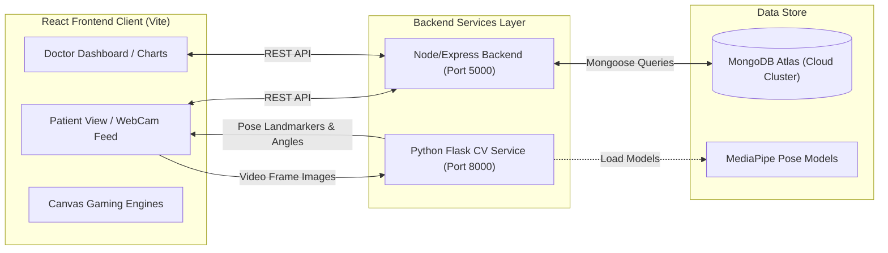
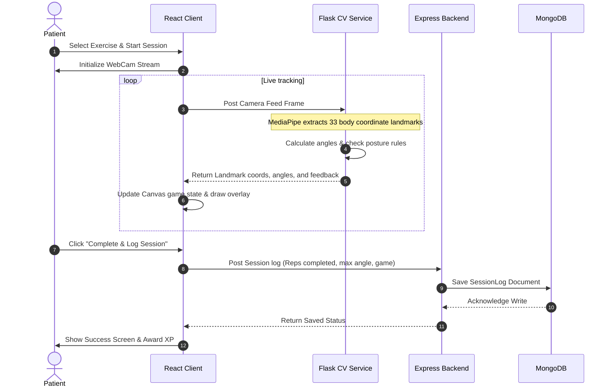

# PoseCare: Project Architecture

This document describes the technical architecture, data pipelines, and component structure of the **PoseCare** digital physical rehabilitation platform.

---

## 1. High-Level System Architecture

PoseCare is built as a decoupled, multi-service system comprising a single-page React frontend, a Node/Express backend, and a Python Flask computer vision microservice.

---

## 2. Component Subsystems

### 💻 1. Frontend SPA (`rehab-ai`)
- **Core Framework**: React (Vite environment) styled with Vanilla CSS and Tailwind utility tokens.
- **Visual Analytics**: Recharts and SVG wrappers plotting patient session records dynamically.
- **Clinical Gaming Engines (`src/games/`)**: Canvas-rendered trackers drawing skeleton joints and overlays:
  - `standardTracker.js`: Mirror camera feed overlaid with joint landmarks.
  - `mannequinTracker.js`: Rotatable 3D hologram avatar.
  - `shadowMatch.js`: Interactive silhouette keyhole matching.
  - `flappyRehab.js`: Altitude flyer mapped to joint extension/flexion.
  - `rehabRunner.js` & `zenBloom.js`: Specialized ROM holds trackers.

### ⚙️ 2. Express Backend (`rehab-backend`)
- **Core Framework**: Node.js and Express REST APIs.
- **Database ORM**: Mongoose mapping MongoDB collections:
  - `User Schema`: Credentials, focus areas, user roles (doctor vs. patient).
  - `Prescription Schema`: Target angles, hold durations, and repetition goals.
  - `SessionLog Schema`: Completed reps, max angles reached, and dates.
- **Services**: Automated seeding utilities, password-based authentication controllers (with legacy OTP code boundaries preserved).

### 👁️ 3. Computer Vision Service (`cv-service`)
- **Core Framework**: Python and Flask.
- **Pose Landmarking Engine**: Google MediaPipe Pose models translating frame images to 33 landmark coordinates.
- **Exercise Analyzers (`exercises/analyzers/`)**:
  - `geometry.py`: Calculates mathematical angles between 3 coordinate coordinates.
  - `joint_angle.py`: Custom analyzers class registry (e.g. `ElbowFlexionAnalyzer`, `BicepCurlShoulderAnalyzer`).
  - `registry.py`: Holds target guidelines, good/bad feedback thresholds, and calibrations.

---

## 3. Data Pipeline: Exercise Session tracking

The diagram below illustrates how joint coordinates are captured, analyzed, and logged in real-time during a training session:

